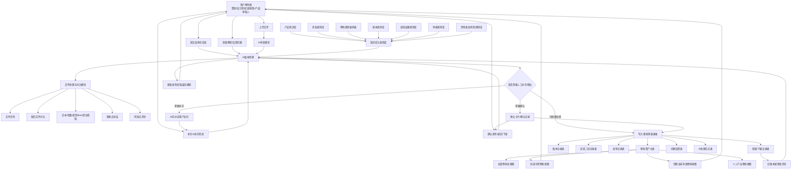
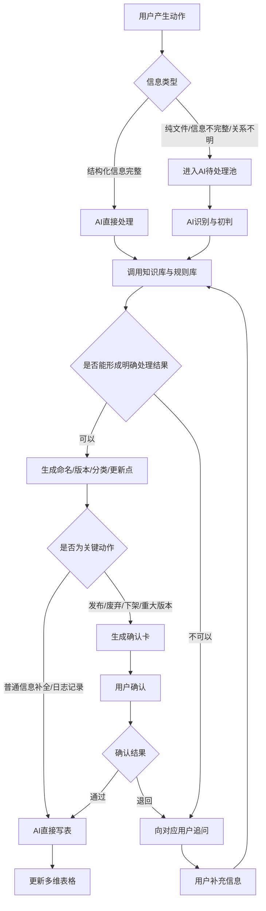
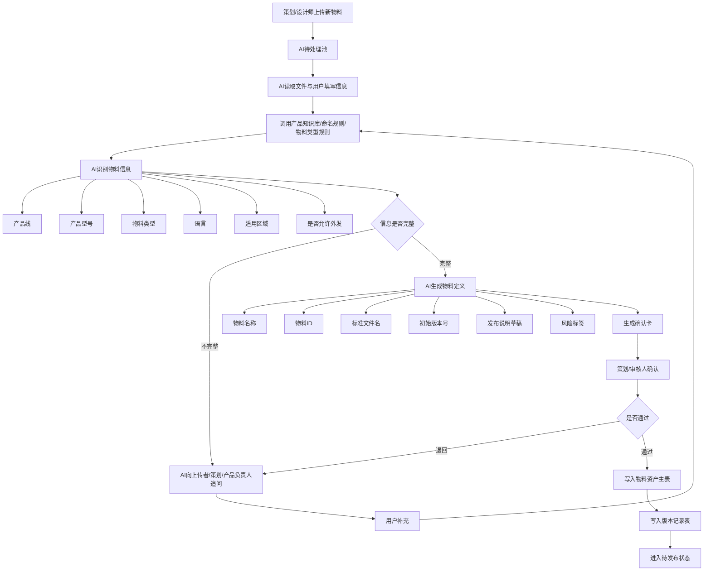
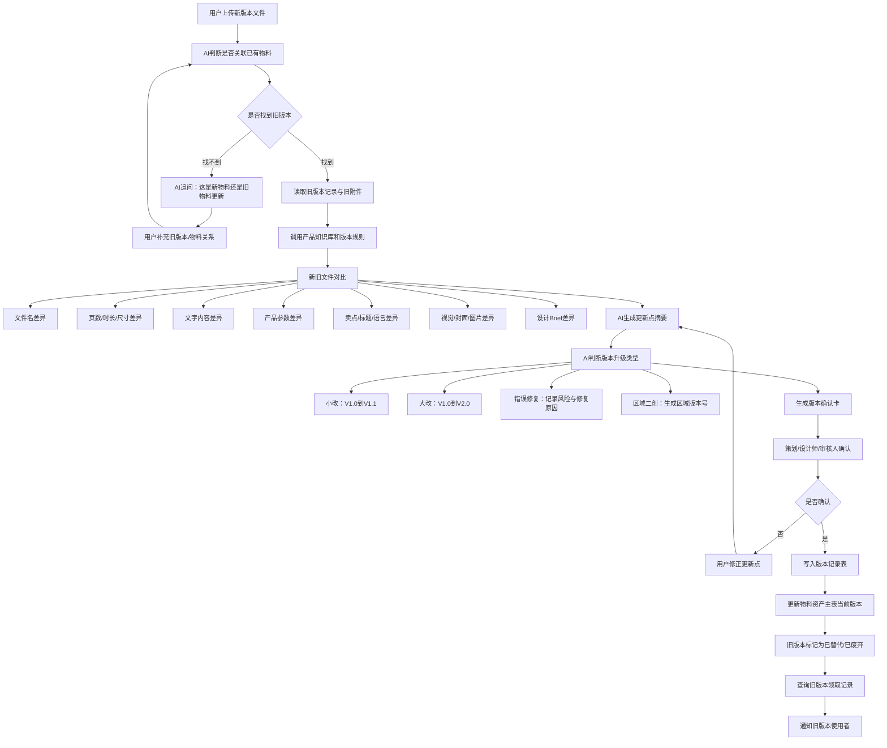
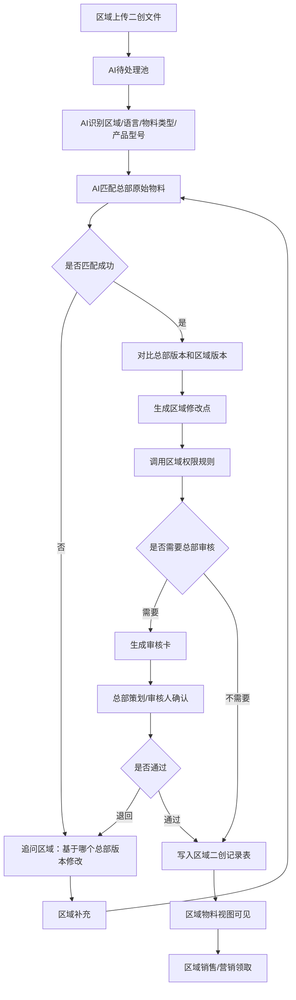
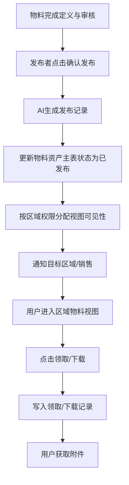
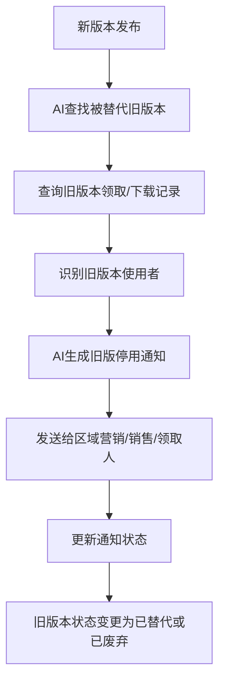
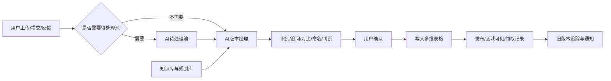

# 基于飞书多维表格的 AI 物料版本管理系统交接文档

## 1. 项目定位

本系统用于解决市场部物料版本混乱、总部与区域资料不同步、销售取用旧版本、区域二创缺少记录、物料更新缺少追踪等问题。

系统形态：

> 以飞书多维表格作为资料载体，以 AI 版本经理作为版本识别、命名、对比、追问、发布辅助和旧版追踪中枢。

核心原则：

1. 多维表格是物料资料库本体，附件、版本、状态、区域、权限、领取记录都围绕多维表格记录展开。
2. AI 版本经理不是流程终点，而是调度、判断、追问、比对、生成、通知的执行中枢。
3. 用户不是单纯入口，而是系统中的持续交互角色，包括策划、设计师、区域营销、销售、审核人、产品负责人等。
4. 不是所有信息都必须先进入 AI 待处理池；部分结构化信息可以由 AI 直接处理并写入对应数据表。
5. AI 可以给建议和执行辅助动作，但发布、下架、废弃、重大版本判断等关键动作应保留人工确认。

---

## 2. 核心角色

| 角色 | 系统职责 |
|---|---|
| 策划 | 提交物料需求、补充物料用途、确认发布说明、决定是否发布 |
| 设计师 | 上传成品、补充设计修改点、确认文件差异 |
| 区域营销 | 提交区域二创、本地化需求、区域反馈 |
| 销售 | 领取当前有效物料，反馈旧版或错误内容 |
| 产品负责人 | 确认产品参数、型号、认证、上市区域等信息 |
| 审核人 | 确认发布、外发权限、下架、废弃和重大版本变更 |
| AI 版本经理 | 识别、命名、对比、追问、生成、巡检、提醒、写表 |
| 多维表格 | 承载物料、版本、知识、规则、发布、下载、反馈等结构化数据 |

---

## 3. 新系统总架构

### 3.1 架构图



### 3.2 架构变化说明

相比前一版，需要执行以下修正：

1. 知识库与规则库是 AI 版本经理的输入项，箭头方向应指向 AI。
2. 用户是系统元素，不只是入口。用户会参与上传、补充、确认、领取、反馈、审核、下架等动作。
3. AI 待处理池不是所有信息的必经路径。它用于兜底处理“文件类、信息不完整类、需识别类、需追问类”任务。
4. 结构化信息可以直接进入 AI 版本经理，由 AI 判断是否写表、追问或生成确认卡。
5. 文件处理与对比模块是 AI 版本经理的能力模块，需要连接旧版本文件、产品知识库、命名规则、版本规则和用户补充信息。

---

## 4. 双通道处理逻辑

系统应采用“双通道”逻辑：

- 通道 A：AI 直接处理通道
- 通道 B：AI 待处理池兜底通道

### 4.1 双通道逻辑图



### 4.2 哪些信息可以 AI 直接处理

| 场景 | 是否经过待处理池 | 处理方式 |
|---|---|---|
| 用户补充产品型号、区域、语言等字段 | 不需要 | AI 直接更新待处理记录或资产记录 |
| 用户确认 AI 生成的命名 | 不需要 | AI 直接写入标准命名字段 |
| 用户确认发布说明 | 不需要 | AI 写入发布记录草稿或最终记录 |
| 销售领取物料 | 不需要 | AI/自动化写入领取记录 |
| 用户反馈问题 | 可直接进入反馈表 | AI 分类后写入问题反馈表 |
| 新文件上传且信息不完整 | 需要 | 进入 AI 待处理池 |
| 区域二创文件上传 | 通常需要 | 进入待处理池，AI 判断基于哪个总部版本 |
| 新旧版本关系不明 | 需要 | 进入待处理池，AI 追问并比对 |
| 批量导入历史物料 | 需要 | 进入待处理池批量清洗 |

---

## 5. 关键业务链路

## 5.1 新物料入库链路



---

## 5.2 版本更新与文件对比链路



---

## 5.3 区域二创链路



---

## 5.4 发布与取用链路



---

## 5.5 旧版本追踪链路



---

## 6. AI 版本经理能力模块

AI 版本经理应拆成以下能力模块。

| 模块 | 说明 |
|---|---|
| 信息识别模块 | 从文件名、附件、用户说明中识别物料类型、产品、区域、语言、负责人等 |
| 知识调用模块 | 调用产品知识库、命名规则库、版本规则库、区域权限规则库等 |
| 文件对比模块 | 对比新旧文件，提取文字、参数、页面、图片、Brief、版本差异 |
| 追问模块 | 发现信息缺失或冲突时，向对应人发起追问 |
| 命名模块 | 生成物料ID、标准文件名、版本ID、区域版本ID |
| 版本判断模块 | 判断首版、小改、大改、错误修复、区域二创、废弃、替代 |
| 风险识别模块 | 识别参数错误、区域不适用、外发风险、旧版风险、重复物料 |
| 确认卡模块 | 将 AI 判断结果整理成人可确认的卡片或记录 |
| 写表模块 | 将确认后的结果写入多维表格各张表 |
| 通知模块 | 发布通知、旧版废弃通知、补信息通知、审核通知、区域同步通知 |
| 巡检模块 | 定期检查旧版本、过期物料、重复推荐版本、无人处理反馈 |

---

## 7. 知识库与规则库设计

## 7.1 产品知识库

用于让 AI 识别产品、判断型号、校验参数、确认区域适用性。

| 字段 | 示例 |
|---|---|
| 产品型号 | IHY-8K48 |
| 产品线 | 逆变器 / 电池 / 一体机 / 便携储能 |
| 产品系列 | IHY / IPV / IGT / ESS / PL / PW |
| 型号拆解规则 | 8K = 8kW，48 = 51.2V 平台 |
| 标准中文名 | 8kW 混合逆变器 |
| 标准英文名 | 8kW Hybrid Inverter |
| 标准卖点 | 高效率、易安装、支持并机等 |
| 适用区域 | 全球 / 非洲 / 东南亚等 |
| 上市状态 | 已上市 / 未上市 / 待确认 |
| 认证状态 | 已认证 / 待认证 |
| 禁用表达 | Generator 等不适用表达 |
| 参数来源 | 产品规格表 / 产品营销总表 |
| 参数状态 | 已确认 / 待确认 |

## 7.2 命名规则库

推荐命名结构：

```text
业务类型-业务线-产品线-产品系列/型号-区域-物料类型-语言-年份-序号-版本号
```

示例：

```text
MAT-ESS-AIO-AIO5K-AF-BRO-EN-2026-001-V1.0
```

区域二创示例：

```text
MAT-ESS-AIO-AIO5K-AF-BRO-EN-2026-001-V1.0-AF-R1
```

字段说明：

| 片段 | 含义 |
|---|---|
| MAT | Marketing Asset，市场物料 |
| ESS | 储能业务 |
| AIO / INV / BAT / PPS | 一体机 / 逆变器 / 电池 / 便携储能 |
| AIO5K / IHY8K48 等 | 产品系列或型号 |
| AF / SEA / ME / GLOBAL | 区域 |
| BRO / FLY / POS / IMG / LFV / SFV / SPEC | 物料类型 |
| EN / CN / FR / AR | 语言 |
| 2026 | 年份 |
| 001 | 序号 |
| V1.0 | 总部版本 |
| AF-R1 | 区域二创版本 |

## 7.3 物料类型编码表

| 物料类型 | 编码 | 是否需审核 | 是否允许二创 | 是否允许外发 |
|---|---|---|---|---|
| 画册 | BRO | 是 | 是 | 是 |
| 单页 | FLY | 是 | 是 | 是 |
| 海报 | POS | 是 | 是 | 视情况 |
| 长图 | IMG | 是 | 是 | 是 |
| 长视频 | LFV | 是 | 是 | 是 |
| 短视频 | SFV | 是 | 是 | 是 |
| 产品规格书 | SPEC | 是 | 否 | 是 |
| 培训资料 | TRN | 是 | 否 | 视情况 |
| PPT | PPT | 是 | 是 | 视情况 |
| 社媒素材 | SOC | 视情况 | 是 | 是 |

## 7.4 版本规则库

| 修改类型 | 版本变化 | 是否需要人工确认 |
|---|---|---|
| 首次发布 | V1.0 | 是 |
| 文案小修 | V1.0 -> V1.1 | 是 |
| 图片替换 | V1.0 -> V1.1 | 是 |
| 翻译修正 | V1.0 -> V1.1 | 是 |
| 产品参数修正 | V1.0 -> V1.1 | 是，且需产品负责人确认 |
| 结构大改 | V1.0 -> V2.0 | 是 |
| 设计风格大改 | V1.0 -> V2.0 | 是 |
| 区域本地化 | 生成区域版本号 | 视规则确认 |
| 错误修复 | 小版本升级并记录修复原因 | 是 |
| 旧版废弃 | 状态改为已废弃 | 是 |

## 7.5 区域权限规则库

| 字段 | 说明 |
|---|---|
| 区域 | 非洲 / 东南亚 / 中东 / 拉美等 |
| 区域编码 | AF / SEA / ME / LATAM |
| 默认语言 | EN / FR / AR / ES 等 |
| 区域成员 | 可领取和查看的人员 |
| 可查看物料类型 | 多选 |
| 是否允许二创 | 是 / 否 |
| 二创是否需总部审核 | 是 / 否 |
| 是否允许客户外发 | 是 / 否 / 视物料类型 |
| 禁用产品 | 未上市或未认证产品 |
| 通知对象 | 区域营销、区域销售、负责人 |

---

## 8. 多维表格数据表设计

## 8.1 AI待处理池

用途：承载需要 AI 识别、追问、对比、清洗的临时任务。

| 字段 | 类型/说明 |
|---|---|
| 待处理ID | 自动编号 |
| 上传文件 | 附件 |
| 上传方式 | 直接发送 / 表单上传 / 区域二创 / 历史导入 |
| 上传者 | 人员 |
| 上传时间 | 日期 |
| 原始文件名 | 文本 |
| 用户填写说明 | 长文本 |
| 设计Brief | 附件/长文本 |
| AI识别结果 | 长文本 |
| 缺失信息 | 长文本 |
| 当前处理状态 | 待识别 / 待补充 / 待确认 / 已入库 / 已退回 |
| AI追问对象 | 人员 |
| 关联旧物料 | 关联物料资产主表 |
| 关联旧版本 | 关联版本记录表 |
| 处理日志 | 长文本 |

## 8.2 物料资产主表

用途：正式物料库，每一条记录是一项物料资产。

| 字段 | 类型/说明 |
|---|---|
| 物料ID | 标准命名生成 |
| 物料名称 | 人可读名称 |
| 标准文件名 | AI生成 |
| 当前有效附件 | 附件 |
| 封面图 | 附件 |
| 产品/品牌物料 | 产品物料 / 品牌物料 |
| 产品线 | 逆变器 / 电池 / 一体机 / 便携储能 |
| 产品系列 | IHY / IPV / AIO / ESS 等 |
| 产品型号 | 多选 |
| 物料类型 | 画册 / 单页 / 海报 / 视频等 |
| 语言 | EN / CN / FR / AR 等 |
| 适用区域 | 全球 / 非洲 / 东南亚等 |
| 当前版本 | V1.0 / V1.1 / V2.0 |
| 版本状态 | Demo / 正式版 / 已替代 / 已废弃 |
| 发布状态 | 待发布 / 已发布 / 已下架 |
| 是否推荐使用 | 是 / 否 |
| 是否允许外发 | 是 / 否 |
| 策划 | 人员 |
| 设计师 | 人员 |
| 审核人 | 人员 |
| 发布时间 | 日期 |
| 有效期 | 日期 |
| 风险标签 | 多选 |
| 下载/领取次数 | 统计字段 |
| 最近领取人 | 人员/统计 |

## 8.3 版本记录表

用途：记录每一次版本变化。

| 字段 | 类型/说明 |
|---|---|
| 版本ID | 物料ID + 版本号 |
| 关联物料 | 关联主表 |
| 版本号 | V1.0 / V1.1 / V2.0 |
| 版本类型 | 首版 / 小改 / 大改 / 区域二创 / 错误修复 |
| 本版附件 | 附件 |
| 对比旧版本 | 关联版本记录 |
| AI对比摘要 | 长文本 |
| 人工确认改动点 | 长文本 |
| 修改原因 | 参数修正 / 文案优化 / 视觉优化 / 区域适配 |
| 修改人 | 人员 |
| 审核状态 | 待审核 / 通过 / 退回 |
| 是否当前有效 | 是 / 否 |
| 替代版本 | 关联记录 |
| 发布时间 | 日期 |

## 8.4 区域二创记录表

| 字段 | 类型/说明 |
|---|---|
| 区域版本ID | 自动/AI生成 |
| 关联总部物料 | 关联主表 |
| 基于总部版本 | 关联版本记录 |
| 区域 | 单选 |
| 语言 | 单选 |
| 修改目的 | 本地化 / 活动 / 渠道适配 / 翻译 |
| 区域附件 | 附件 |
| AI对比摘要 | 长文本 |
| 区域修改说明 | 长文本 |
| 审核状态 | 待审核 / 通过 / 退回 |
| 是否允许外发 | 是 / 否 |
| 是否当前区域有效版本 | 是 / 否 |

## 8.5 发布记录表

| 字段 | 类型/说明 |
|---|---|
| 发布ID | 自动编号 |
| 关联物料 | 关联主表 |
| 发布版本 | 关联版本记录 |
| 发布人 | 人员 |
| 发布区域 | 多选 |
| 发布对象 | 区域营销 / 区域销售 / 全员 |
| 发布时间 | 日期 |
| 发布说明 | AI生成后人工确认 |
| 是否通知旧版本废弃 | 是 / 否 |
| 旧版本处理方式 | 已废弃 / 已替代 / 保留历史 |

## 8.6 领取/下载记录表

用途：记录谁使用过哪个版本，为后续旧版本通知提供依据。

| 字段 | 类型/说明 |
|---|---|
| 记录ID | 自动编号 |
| 物料 | 关联主表 |
| 版本号 | 关联版本记录 |
| 领取/下载人 | 人员 |
| 所属区域 | 单选 |
| 下载时间 | 日期 |
| 使用目的 | 客户发送 / 活动 / 渠道培训 / 内部学习 |
| 是否已被新版替代 | 是 / 否 |
| 是否已通知 | 是 / 否 |

## 8.7 问题反馈表

| 字段 | 类型/说明 |
|---|---|
| 问题ID | 自动编号 |
| 关联物料 | 关联主表 |
| 关联版本 | 关联版本记录 |
| 反馈人 | 人员 |
| 问题类型 | 参数错误 / 翻译错误 / 视觉错误 / 过期版本 / 其他 |
| 问题描述 | 长文本 |
| 严重程度 | 高 / 中 / 低 |
| 处理负责人 | 人员 |
| 处理状态 | 待处理 / 处理中 / 已修复 / 不处理 |
| 修复版本 | 关联版本记录 |
| 是否需要下架 | 是 / 否 |

## 8.8 AI处理日志表

用途：记录 AI 的判断过程和动作，便于追责、复盘和优化。

| 字段 | 类型/说明 |
|---|---|
| 日志ID | 自动编号 |
| 关联对象 | 物料/版本/反馈/发布 |
| AI动作类型 | 识别 / 命名 / 对比 / 追问 / 写表 / 通知 / 巡检 |
| 输入信息摘要 | 长文本 |
| 调用知识库 | 多选/文本 |
| AI判断结果 | 长文本 |
| 人工确认结果 | 通过 / 修正 / 退回 |
| 执行时间 | 日期 |
| 执行状态 | 成功 / 失败 / 待人工处理 |

---

## 9. AI 与人的交互机制

## 9.1 AI 追问规则

AI 遇到以下情况必须追问，不应强行写入正式库。

| 场景 | 追问对象 | 示例问题 |
|---|---|---|
| 产品型号识别不出 | 上传者 / 策划 | 这个物料对应哪个产品型号？ |
| 产品参数疑似冲突 | 产品负责人 | 文件中的功率/容量是否以规格书为准？ |
| 适用区域不明确 | 上传者 / 区域营销 | 这个物料适用于哪个区域？ |
| 是否外发不明确 | 策划 / 审核人 | 该物料是否允许销售发给客户？ |
| 版本关系不清楚 | 上传者 / 设计师 | 这是新物料，还是基于旧版本修改？ |
| 更新点不明确 | 设计师 / 策划 | 本次主要修改了哪些页面或内容？ |
| 区域二创来源不清楚 | 区域营销 | 该二创版本基于总部哪个版本？ |
| 旧版本处理不明确 | 策划 / 审核人 | 旧版本是否废弃、替代或保留？ |

## 9.2 确认卡内容

AI 在发布、版本更新、区域二创、废弃旧版前，应生成确认卡。

确认卡至少包含：

1. 物料名称
2. 标准物料ID
3. 标准文件名
4. 物料类型
5. 产品线/产品型号
6. 适用区域
7. 语言
8. 当前版本号
9. 本次更新点
10. AI识别风险
11. 是否允许外发
12. 是否推荐使用
13. 旧版本处理建议
14. 需要通知对象
15. 确认按钮：通过 / 退回补充 / 修改字段 / 暂不发布

---

## 10. MVP 实施范围

## 10.1 P0 必须实现

1. 建立多维表格基础数据结构：
   - AI待处理池
   - 物料资产主表
   - 版本记录表
   - 产品知识库
   - 命名规则库
   - 物料类型编码表
   - 发布记录表

2. 实现基础 AI 版本经理能力：
   - 新物料识别
   - 标准命名生成
   - 版本号生成
   - 信息缺失追问
   - 发布确认卡生成
   - 写入物料资产主表

3. 建立基础视图：
   - 当前有效版本视图
   - 待处理物料视图
   - 待发布物料视图
   - 区域可用物料视图
   - 已废弃/已替代版本视图

## 10.2 P1 建议第二阶段实现

1. 新旧文件对比
2. 区域二创记录
3. 领取/下载记录
4. 旧版本通知
5. 问题反馈闭环
6. AI处理日志
7. 产品参数风险检查

## 10.3 P2 后续增强

1. 视频关键帧/字幕识别
2. 图片视觉差异识别
3. 周度版本健康报告
4. 区域版本健康度看板
5. 批量历史物料清洗
6. 自动巡检旧版本外流风险
7. 自动识别销售仍在使用的旧版本

---

## 11. 执行 AI 的交接任务清单

执行 AI 接到本文件后，建议按以下顺序推进。

### 第一步：搭建多维表格结构

创建以下数据表：

1. AI待处理池
2. 物料资产主表
3. 版本记录表
4. 产品知识库
5. 命名规则库
6. 物料类型编码表
7. 区域权限规则库
8. 发布记录表
9. 领取/下载记录表
10. 问题反馈表
11. AI处理日志表

### 第二步：先录入规则库

优先录入：

1. 产品线编码
2. 产品系列编码
3. 物料类型编码
4. 区域编码
5. 语言编码
6. 版本升级规则
7. 外发权限规则
8. 审核规则

### 第三步：配置核心视图

至少配置：

1. 当前有效版本视图
2. 待处理池视图
3. 待发布视图
4. 区域可用物料视图
5. 区域二创待审核视图
6. 已废弃版本视图
7. 问题反馈待处理视图

### 第四步：设计 AI 处理流程

先实现 5 个能力：

1. 上传文件后进入 AI 待处理池
2. AI 根据规则生成物料ID和标准文件名
3. AI 发现信息不足时追问用户
4. AI 生成发布确认卡
5. 用户确认后写入物料资产主表和版本记录表

### 第五步：补充版本对比能力

实现逻辑：

1. 上传新文件时，AI 查找可能关联的旧物料
2. 找到旧版本后进行新旧文件对比
3. 生成更新点摘要
4. 判断版本升级类型
5. 生成版本确认卡
6. 人工确认后更新版本记录和旧版本状态

### 第六步：补充领取记录与旧版通知

实现逻辑：

1. 用户点击领取/下载时写入领取记录
2. 新版本发布时查询旧版本领取人
3. AI 生成旧版本停用通知
4. 通知相关用户切换到新版本

---

## 12. 执行原则

1. 先保证业务能跑，不追求一次性自动化到位。
2. 所有关键发布动作必须有人确认。
3. AI 的输出必须落表，不能只停留在聊天记录里。
4. 文件附件要挂在多维表格记录上，不能散落在个人聊天或个人云盘。
5. 所有物料必须有唯一物料ID。
6. 所有版本必须有版本记录。
7. 所有发布必须有发布记录。
8. 所有领取最好有领取记录，以便后续旧版本通知。
9. 区域二创必须关联总部原始版本。
10. 知识库和规则库要持续维护，否则 AI 判断会越来越不稳定。

---

## 13. 最终系统一句话定义

本系统是一个以飞书多维表格为资料载体、以 AI 版本经理为调度中枢、以知识库和规则库为判断依据、以用户确认和反馈为闭环机制的市场物料版本管理系统。

它的核心链路是：



